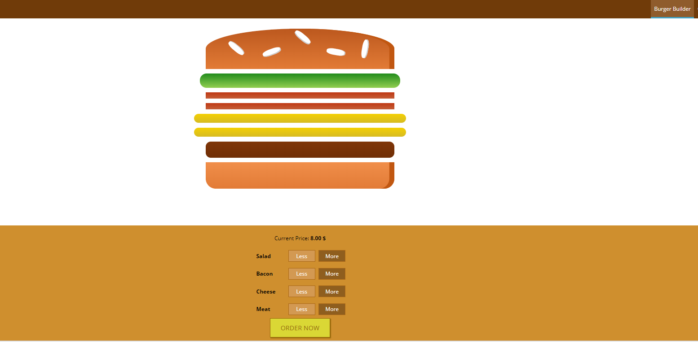
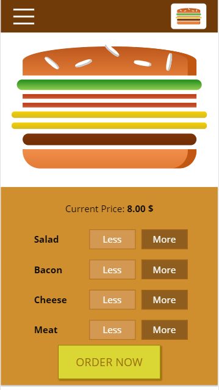

## My Burger - React App

### Description

A small app where you build and order a burger. The app was created by me for

the purpose of learning and discovering the power of React.JS.

### Install

In the project directory run:

#### `npm install`

#### `npm start`

To see the running app, go to:
#### `http://localhost:8081/`

#### Link to aws server:

#### [https://burger.rrazvan.dev](https://burger.rrazvan.dev)

### Desktop Version

  

---
### Mobile version

  

---

###### Created by Razvan Rauta
